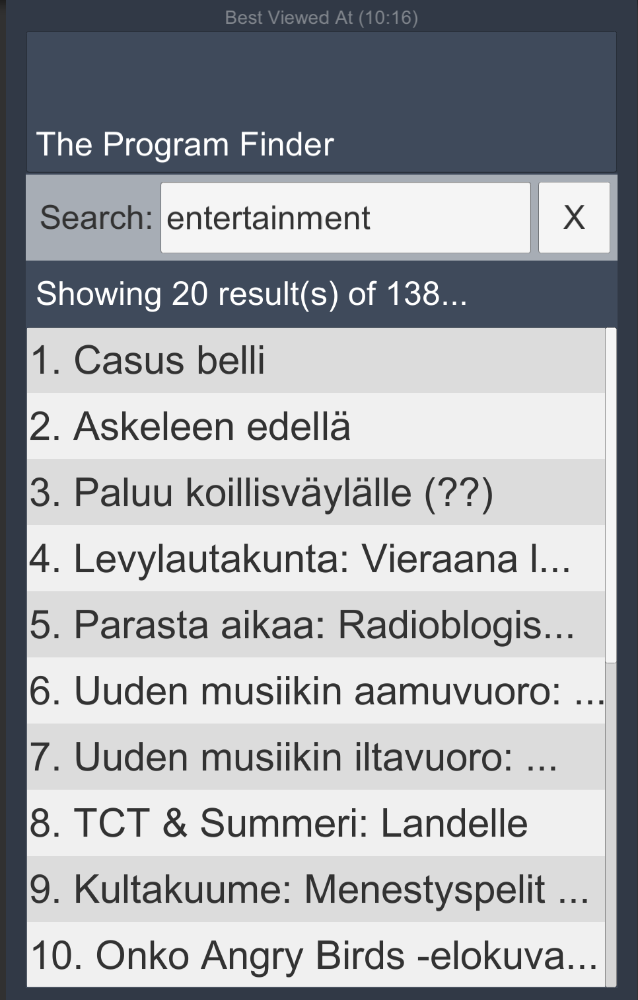

--------------

What are ScriptableObjects?
=============
<a href="https://unity3d.com/learn/tutorials/modules/beginner/live-training-archive/scriptable-objects">Scriptable Objects</a> are amazing data containers. They don't need to be attached to a GameObject in a scene. They can be saved as assets in our project. 

This Project
=============

Overview

* Simple demo showing a mix of ScriptableObject and non ScriptableObject data within the same parent object so you can compare each.

Technologies Used:

* Unity
* Unity UI
* ScriptableObject

Screenshot
=============

Instructions
=============
* Run the scene. 
* Click the button below. 
* Change the 'AmericanGenes' in the project through inspector. 
* See all affect the output text while the scene is playing.

Structure Overview
=============

* **/Scripts/RMC/Runtime/Core/** contains generalized code
* **/Scripts/RMC/Runtime/Projects/ScriptableObjectDemo/** contains code specific for this app

Code Overview
=============
* **ScriptableObjectDemo.cs** is the main entry point

Open Questions
=============
* None

TODO
=============
* Done

Created By
=============

- Samuel Asher Rivello <a href="https://twitter.com/srivello/">@srivello</a>, <a href="http://www.github.com/RivelloMultimediaConsulting/">Github</a>, <a href="http://RivelloMultimediaConsulting.com/unity/">RivelloMultimediaConsulting.com</a>, <a href="http://www.UnityGameDeveloper.com/">UnityGameDeveloper.com </a>

